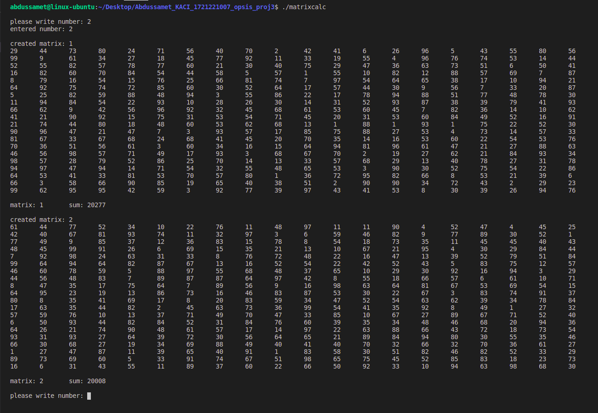
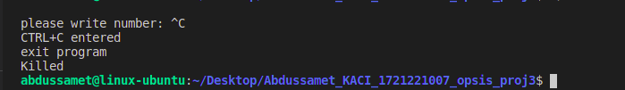
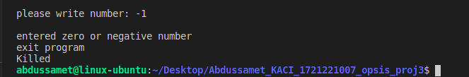

# Thread Synchronization
There is 1 makefile in the project. The program creates a 20x20 matrix and takes the sum of the elements of this matrix 
and prints it on the screen. While doing these works, we use multithreading. So more than one thread is used. 
Two threads are used in the project (thread_matrix_creator and thread_matrix_sum). 
The thread named thread_matrix_creator creates a 20x20 matrix and prints it to the screen. 
The thread named thread_matrix_sum collects this matrix and prints it to the screen. 
These threads run in a loop. We also have a main program. In this program, the user is asked how many matrices to create.
The entered number of matrix is created and the user is asked for the number again. This loop continues until the user 
enters a zero or negative number.

In addition, signal capture process was also carried out in this project. If the user presses any of the keypads 
such as CTR+C or CTRL+Z while using the program, an exit signal is sent to the program and the threads are terminated 
and the program exits.

## Main App

## Signal Capture

## Zero or Negative Input

